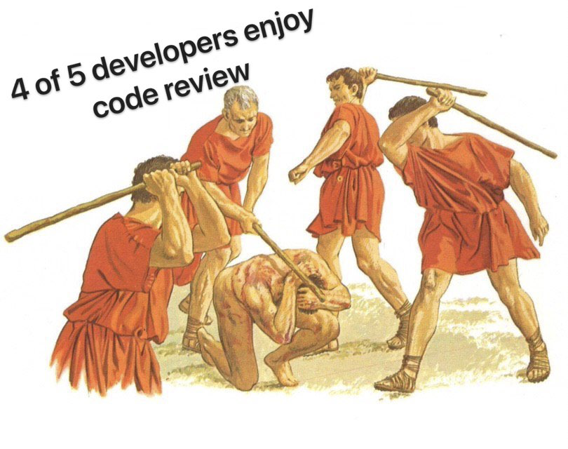

<!-- Slide 1: Title -->
# How to do Code Review like a Pro
### Treat review as the fastest learning loop.


<sub><b>Jacek:</b> hands-on engineer & architect, code reviews daily, Gerrit maintainer</sub>
<!--
Hi, I’m Jacek — hands‑on software engineer and architect, code review daily practitioner, last and NOT least Gerrit maintainer.
Today we're talking about how to do code review like a pro.
The answer is simple: treat review as the fastest learning loop.
Not a gate, not a formality - a learning loop. If we optimize that loop, quality will follow.
-->

---

<!-- paginate: true -->
<!-- Slide 2: Why Reviews Matter -->
## Why reviews matter

- Build shared understanding, not just gate code
- Mentor across experience levels, daily
- Align practices, patterns, invariants
- Spread insights across the codebase
- Quality improves **via knowledge transfer**

<sub>[Bacchelli & Bird (ICSE’13)](https://sback.it/publications/icse2013.pdf); [Wen–Lamothe–McIntosh (ICSE‑SEIP’22)](https://lamothemax.github.io/assets/papers/rwen_icse_2022.pdf)<sub>

<!--
Code review isn't just about catching bugs. It's our best opportunity for knowledge transfer. When a senior developer explains why we chose this architectural pattern during review, that knowledge spreads to the whole team. When we align on practices through review, consistency improves across the codebase. When we share domain insights we break down silos.

Research backs this up. Studies show that code review serves dual purposes: technical quality improvements and knowledge sharing among team members. It is not some imaginary situation described in book: It's mentoring in context, exactly when developers need it. This dual benefit is review's USP.
-->

---

<!-- Slide 3: Tangible outcomes -->
## Tangible outcomes
#### Readable diffs. Reliable changes. Repeatable decisions
- **Review turnaround** ≤ 1 business day
- **Median review size** ≤ ??? changed lines
- **Tests updated:** CI green on merge
- **Traceability:** link issue / ADR / RFC
- **Post-release defects** trending down

<sub>_"Higher participation & coverage → fewer post-release defects."_ [McIntosh et al., MSR 2014; EMSE 2016](https://rebels.cs.uwaterloo.ca/papers/emse2016_mcintosh.pdf)</sub>

<!--
So what does "good review" look like? How it could be measured?

Review turnaround under one business day — keeps developers in flow state, prevents costly context switching.

Median PR size with reasonable amount of changed lines — research and practice show smaller changes get better, faster reviews.

Tests updated and CI green on merge — let automation police correctness baselines so reviews focus on design.

Traceability: every PR links to an issue, ADR, or RFC—makes changes auditable months later.

Post-release defects trending down—the ultimate outcome metric. If defects are dropping, our review process is working.

Evidence matters. Research from McIntosh and colleagues showed that coverage and participation directly correlate with fewer escaped defects. Measure what matters.
-->

---

<!-- Slide 4: Author mindset Shift -->
## Author mindset

_"If it’s hard to review, it’s hard to maintain."_

<sub>Your job: help reviewers help you.<sub>

<!--
As an author, move from “prove it works” to “make it easy to review.”

Many developers approach PRs defensively—here's my code, here's why it's correct, approve it. Wrong mindset. Instead, optimize for reviewer success. Your job is to help reviewers help you. Make it trivial for them to understand context, spot real issues, and provide valuable feedback. This mindset shift reduces the review cycle, keeps participation high and as a result accelerates the entire review cycle.
-->

---

<!-- Slide 5: Author techniques -->
## Author techniques

- Small, single-concern reviews; separate refactors.  
- Write the **what** first (template what / why / extra context ).
- **Conventional Commits:** feat / fix / chore / ... for history and context.
- Self-review checklist before request.
- Let tools catch nits (fmt, lint, tests).
- Use agents (copilot, etc.) for scaffolding - you verify.


<sub>[https://www.conventionalcommits.org/](https://www.conventionalcommits.org/)</sub>

<!--
How do authors make review easy? Six techniques.

First, keep reviews small — one concern per change. A focused diff is a reviewable diff.

Second, use a review description template. Answer: What was changed and why - what is the intent? How should I review this? What tests did you add? What's the rollout plan? This context is gold.

Third, adopt Conventional Commits for clear history. Prefixes like "fix:", "feat:", etc. make git log scannable and enable changelog automation.

Fourth, run a self-review checklist before requesting review. You'll catch issues yourself—don't waste reviewer time on things you could have spotted. Again this can be a team wide checklist that you can collectively build with points like: naming conventions, tests coverage etc...

Fifth, employ IDE and builder to run format, lint, grammar checks and tests (if feasible) locally before review. Don't send broken code. Let CI be a safety net, not the first line of defense.

Sixth, if you company policy allows then use coding agent to scaffold tests or boilerplate function — then you verify correctness. Copilot and others can draft anything from scaffold to fully functioning code parts; you ensure it's right. Never offload the verification part to CI or reviewers.
-->

___

<!-- Slide 6: Reviewer mindset shift from -->
## Reviewer mindset shift from "find flaws"

<style scoped>
img[alt~="center"] {
  display: block;
  margin: 0 auto;
}
</style>


<sub>[r/ProgrammerHumor](https://www.reddit.com/r/ProgrammerHumor/comments/eftj9g/u_enjoy/)</sub>

---

<!-- Slide 7: Reviewer mindset shift to -->
## Reviewer mindset shift to "coach craft"

**Label every comment:** blocking / non-blocking / nit

<sub>Principles over opinions.</sub>

<!--
As a reviewer, shift from “find flaws” to “coach craft.”

You’re not just a gate; you’re a guide. Always label severity so authors can prioritize: blocking (must fix before merge), nnn-blocking (important but not a show-stopper, can be addressed in follow-up), nit (minor polish).

And explain principles, not just fixes. Buck it up, if needed, with evidence. When you teach the underlying reason — "we use dependency injection here to enable testing" — that's knowledge transfer in action. You're not just fixing this PR; you're leveling up this developer.
-->

---

<!-- Slide 8: Reviewer techniques with Conventional Comments -->
## Reviewer Techniques: Conventional Comments
#### For clear, actionable feedback.

```
<TAG> (decorations): <brief summary>
Context: why it matters (principle/invariant)
Suggestion: concrete change (or diff)
Outcome: what improves if applied
```

Tags: **issue, suggestion, question, praise, nit, thought, ...**
Decorations: **blocking, non-blocking, if-minor, ...**

<sub>[https://conventionalcomments.org/](https://conventionalcomments.org/)</sub>

<!--
Conventional Comments give structure. Tag tells clearly the intent—is this blocking? Context explains the why. Suggestion gives a concrete fix. Outcome shows the benefit. Tie to a principle so decisions are repeatable. Tools like Copilot can draft the diff, but you add context and severity: tools suggest, humans decide on principles.
-->

---

<!-- Slide 9: Bad → Good Comment example -->
## Bad → Good (comment example)
**Bad:** _“Just use a map here.”_

**Good (Conventional Comments):**
```
issue (blocking): Replace linear search with HashMap
Context: List lookup is O(n) - bigger n slower lookup. Map preserves O(1).
Suggestion: userMap.get(id) instead of users.find()
Outcome: Maintains performance under load
```

<sub>Coach with principles; show the outcome.</sub>

<!--
Let’s rewrite a terse, low‑context comment into a coaching comment grounded in principles.

Before: “Just use a map here.”
No rationale, no severity, no guidance, no outcome.

After (Conventional Comments):
issue: Replace linear search with HashMap

Context: List lookup is O(n) and grows with each element added. That is the place to cite/link principles

Suggestion: userMap.get(id) instead of users.find(); preserves O(1)

Outcome: Keeps latency stable under load; fewer timeouts under peak.

Finally, label blocking depending on the SLA risk. Notice how the “why” is explicit, the fix is concrete, and the effect is measurable.
-->

---

<!-- Slide 10: Team practices & tooling -->
## Team practices & tooling

- Review templates; CODEOWNERS/rotation.  
- SLAs: first response ≤1 business day.
- Link ADR/RFC when principles apply.
- Tooling: IDE, formatters, linters, tests, review with agent.
- **Conventional Commits** for clean history.
- **Conventional Comments** for replies.

<sub>Make great reviews the default.</sub>

<!--
Sustainable review culture is a team sport:

Add review description templates to your repository — consistency by default. Use CODEOWNERS or rotation to ensure coverage and boost participation.

Set an SLA: first response within one business day — keeps the momentum.

Link to ADRs or RFCs when you cite a principle — builds institutional memory.

Employ tools: let IDE formatters, linters and unit tests — catch trivial issues before human review. Enable and tune agent (like Copilot) code review on your PRs to draft initial feedback: reviewers still label severity and apply Conventional Comments.

Adopt Conventional Commits for clean history that enables automation and give additional context to reviewer.

Use tools mentioned in the ConventionalComments or create saved replies that follow their format — save time and spread best practices.
-->

---

<!-- Slide 11: Anti-patterns & fixes -->
## Anti-patterns & fixes

| Anti-pattern | Fix |
|--------------|-----|
| Mega-PRs | Split by feature or commits |
| Drive-by nit-picking | Use "issue(blocking)" |
| Rubber-stamps | "What I checked" comment |
| Bikeshedding | Cite guideline, short RFC, follow-up |

<sub>Block on principles, not preferences.<sub>

<!--
Watch out for four anti-patterns.

Mega‑PRs - overwhelm reviewers. Fix: split by concern and land behind feature flags.

Drive‑by nit-picking without priority wastes time. Fix: batch nits together; focus the rest on principles.

Rubber‑stamps mean no real review happened. Fix: require a short “what I checked” checklist to make review effort visible.

Bikeshedding - endlessly debating trivial style. Fix: cite a guideline, draft a short RFC, agree to follow-up; timebox the thread and move on.

Block on principles, not preferences. Architecture matters. Formatting doesn't.
-->

---

<!-- Slide 12: Summary & call to action -->
## Summary & call-to-action
#### Focus the diff. Coach with principles. Let tools police nits.

<style scoped>
  .left-align {
    text-align: left
  }
</style>
<div class="left-align">By next Friday:</div>

- Use review template & self-review checklist.
- Adopt **Conventional Comments** + tags and severity labels.
- Pilot **Conventional Commits** to improve history.

<sub>Thanks! [https://geminicaprograms.github.io/code_review_like_a_pro/events-openinfra-2025/](https://geminicaprograms.github.io/code_review_like_a_pro/events-openinfra-2025/)</sub>

<!--
The 3 things that you can carry out of the room:

Focus the diff. Small, well‑explained changes get better feedback.

Coach with principles. Use Conventional Comments to make the “why” explicit.

Let tools police nits. IDE, formatter, linters, CI, and Copilot handle the grind so humans make judgment calls.

By the next Friday, try these moves:

Use the review template and a quick self‑review checklist.

Adopt Conventional Comments with tags and severity decorations.

Pilot Conventional Commits to improve history and give extra context.

Do these, and you’ll make reviews faster, more consistent, and more effective — and your team will level up together. Thank you.
-->