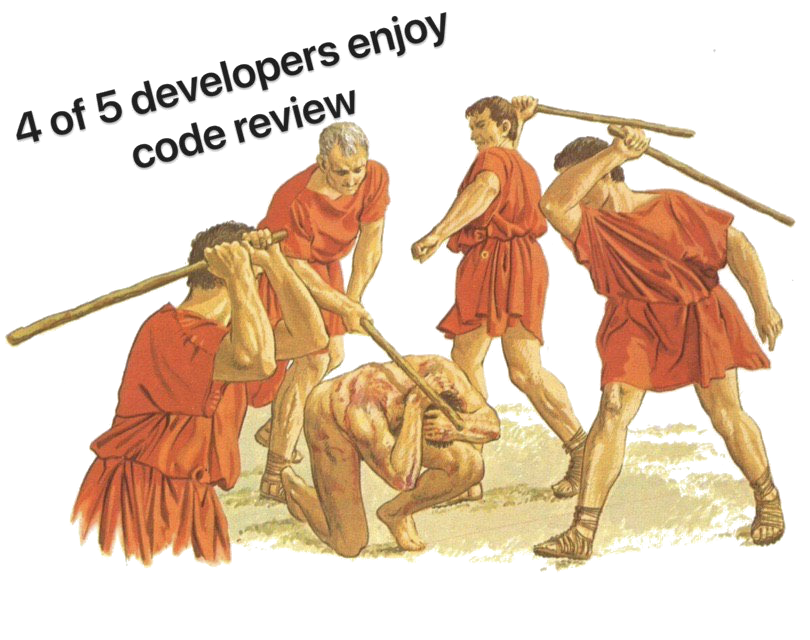

<!-- Slide 1: Title -->
# How to do Code Review like a Pro
### Treat review as the fastest learning loop.


<sub><b>Jacek:</b> hands-on engineer & architect, code reviews daily, Gerrit maintainer</sub>
<!--
Hook: “Most teams treat review as a gate. Pros treat it as the fastest learning loop in the codebase.”
Promise: in 15 minutes they’ll learn how authors and reviewers make reviews faster, clearer, and more useful.
-->

---

<!-- paginate: true -->
<!-- Slide 2: Why Reviews Matter -->
## Why reviews matter

- Build shared understanding, not just gate code
- Mentor across experience levels, daily
- Align practices, patterns, invariants
- Spread insights across the codebase
- Quality improves **via knowledge transfer**

<sub>[Bacchelli & Bird (ICSE’13)](https://sback.it/publications/icse2013.pdf); [Wen–Lamothe–McIntosh (ICSE‑SEIP’22)](https://lamothemax.github.io/assets/papers/rwen_icse_2022.pdf)<sub>

<!--
Code review isn't just bug-catching game. When a senior dev explains why we chose this pattern, that knowledge spreads. When teams align on style through review, consistency improves. Research confirms review delivers both quality gains and knowledge transfer. This dual benefit makes it irreplaceable.
Paraphrasing McIntosh: “Review is a software quality tool and a knowledge-transfer tool. Focus on knowledge transfer and quality follows.”
-->

---

<!-- Slide 3: Tangible outcomes -->
## Tangible outcomes
#### Readable diffs. Reliable changes. Repeatable decisions
- **Review turnaround** ≤ 1 business day
- **Median review size** ≤ ??? changed lines, chain of changes
- **Traceability:** link issue / ADR / RFC
- **Post-release defects** trending down

<sub>_"Higher participation & coverage → fewer post-release defects."_ [McIntosh et al., MSR 2014; EMSE 2016](https://rebels.cs.uwaterloo.ca/papers/emse2016_mcintosh.pdf)</sub>

<!--
Fast turnaround keeps flow state. Small PRs get better reviews (limited focus span, context switch). Green CI and traceability make changes auditable. Track defects to confirm we're improving.
Coverage and participation correlate with fewer post-release defects. Knowledge sharing lifts both.
-->

---

<!-- Slide 4: Author mindset Shift -->
## Author mindset

_"If it’s hard to review, it’s hard to maintain."_

<sub>Your job: help reviewers help you.<sub>

<!--
Authors often defend their code. Wrong mindset. Instead, optimize for review speed and quality. Make it trivial for reviewers to understand context, spot issues, and provide valuable feedback. This shift accelerates the entire cycle.
-->

---

<!-- Slide 5: Author techniques -->
## Author techniques

- Small, single-concern reviews; separate refactors.  
- Write the **what** first (template what / why / extra context ).
- **Conventional Commits:** feat / fix / chore / ... for history and context.
- Self-review checklist before request.
- Let tools catch nits (fmt, lint, tests).
- Use agents (copilot, etc.) for scaffolding - you verify.


<sub>[https://www.conventionalcommits.org/](https://www.conventionalcommits.org/)</sub>

<!--
Keep reviews focused: one feature, one bug (chain reviews or at least commits, cross layers - plant that in your agents). Use a template so reviewers know context instantly. Conventional Commits make history scannable. Self-review catches 30% of issues before human eyes see it. Run all checks locally—don't waste reviewer time on lint errors. Agents (like claude, copilot, ...) can draft boilerplate/solution - you validate correctness. This prep work pays dividends.
-->

___

<!-- Slide 6: Reviewer mindset shift from -->
## Reviewer mindset shift from "find flaws"

<style scoped>
img[alt~="center"] {
  display: block;
  margin: 0 auto;
}
</style>


<sub>[r/ProgrammerHumor](https://www.reddit.com/r/ProgrammerHumor/comments/eftj9g/u_enjoy/)</sub>

---

<!-- Slide 7: Reviewer mindset shift to -->
## Reviewer mindset shift to "coach craft"

**Label every comment:** blocking / non-blocking / nit

<sub>Principles over opinions.</sub>

<!--
Reviewers often play gotcha. Better approach: teach. Label severity so authors know what's critical versus optional. Explain the principle behind your feedback - link ADR, etc.. that's knowledge transfer in action tied to the context.
-->

---

<!-- Slide 8: Reviewer techniques with Conventional Comments -->
## Reviewer Techniques: Conventional Comments
#### For clear, actionable feedback.

```
<TAG> (decorations): <brief summary>
Context: why it matters (principle/invariant)
Suggestion: concrete change (or diff)
Outcome: what improves if applied
```

Tags: **issue, suggestion, question, praise, nit, thought, ...**
Decorations: **blocking, non-blocking, if-minor, ...**

<sub>[https://conventionalcomments.org/](https://conventionalcomments.org/)</sub>

<!--
Conventional Comments give structure. Tag tells clearly the intent—is this blocking? Context explains the why. Suggestion gives a concrete fix. Outcome shows the benefit. Tie to a principle so decisions are repeatable. Tools like Copilot can draft the diff, but you add context and severity: tools suggest, humans decide on principles.
-->

---

<!-- Slide 9: Bad → Good Comment example -->
## Bad → Good (comment example)
**Bad:** _“This is wrong. Use a map.”_

**Good (Conventional Comments):**
```
issue (blocking): Violates performance invariant (stable O(1) lookup).
Context: List lookup is O(n) and grows with each call.
Suggestion: Use map; preserves O(1).
Outcome: Faster and consistent under load.
```

<sub>Coach with principles; show the outcome.</sub>

---

<!-- Slide 10: Team practices & tooling -->
## Team practices & tooling

- Review templates; CODEOWNERS/rotation.  
- SLAs: first response ≤1 business day.
- Link ADR/RFC when principles apply.
- Tooling: IDE, formatters, linters, tests, review with agent.
- **Conventional Commits** for clean history.
- **Conventional Comments** for replies.

<sub>Make great reviews the default.</sub>

<!--
Systemize quality. Templates ensure consistency. Code owners or rotation guarantee coverage and knowledge spread. SLA prevents PRs from loosing traction. Link to ADRs when you invoke a principle—builds institutional memory. Tooling catch trivial issues. Agent code review can draft initial feedback. Conventional Commits make git log useful. Saved replies save time and spread best practices.
Institutionalize habits so quality scales.
-->

---

<!-- Slide 11: Anti-patterns & fixes -->
## Anti-patterns & fixes

| Anti-pattern | Fix |
|--------------|-----|
| Mega-PRs | Split by feature or commits |
| Drive-by nit-picking | Use major/blocker |
| Rubber-stamps | "What I checked" comment |
| Bikeshedding | Cite guideline, short RFC, follow-up |

<sub>Block on principles, not preferences.<sub>

<!--
Mega-PRs overwhelm—split them. Nit-picking without priority wastes time, focus on major issues. Rubber stamps mean no real review—ask reviewers to state what they verified. Bikeshedding: arguing tabs versus spaces, wastes energy. Cite a team guideline or write a quick RFC, agree to follow-up. Block on architecture, not formatting.
-->

---

<!-- Slide 12: Summary & call to action -->
## Summary & call-to-action
#### Focus the diff. Coach with principles. Let tools police nits.

<style scoped>
  .left-align {
    text-align: left
  }
</style>
<div class="left-align">By next Friday:</div>

- Use review template & self-review checklist.
- Adopt **Conventional Comments** + severity tags.
- Pilot **Conventional Commits** for 2 weeks.

<sub>Thanks! [https://geminicaprograms.github.io/open_infra_summit_2025](https://geminicaprograms.github.io/open_infra_summit_2025)</sub>

<!--
Three rules to remember: focus diffs, coach with principles, automate nits. Start this Friday. Add a review template. Label your comments with severity. Try Conventional Commits for two weeks—you'll see cleaner history. Turn on Copilot code review. Let agents do scaffolding. Small changes compound into faster, better reviews. Thank you.
-->